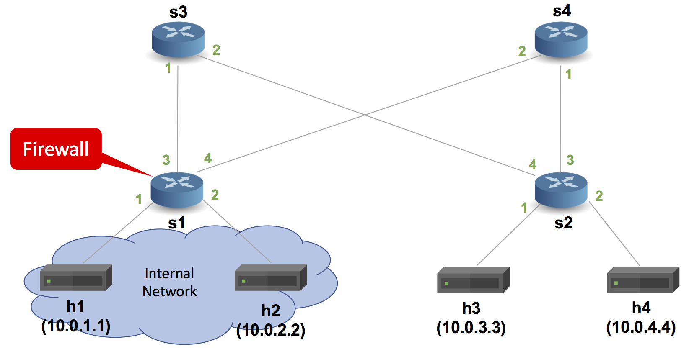

[comment]: # (SPDX-License-Identifier:  Apache-2.0)

# Implementing A Basic Stateful Firewall with Rate Limiting

## Introduction

The objective of this exercise is to write a P4 program that
implements a simple stateful firewall with rate limiting capabilities. 
This implementation uses a bloom filter for connection tracking and 
register-based rate limiting for external traffic control.

We will use the pod-topology for this exercise, which consists of
four hosts connected to four switches, which are wired up as they
would be in a single pod of a fat tree topology.



Switch s1 will be configured with a P4 program that implements a
simple stateful firewall (`firewall.p4`), the rest of the switches will run the
basic IPv4 router program (`basic.p4`).

The firewall on s1 has the following functionality:
* Hosts h1 and h2 are on the internal network and can always
  connect to one another.
* Hosts h1 and h2 can freely connect to h3 and h4 on the
  external network.
* Hosts h3 and h4 can only reply to connections once they have been
  established from either h1 or h2, but cannot initiate new
  connections to hosts on the internal network.
* **Rate Limiting**: Traffic from h3/h4 to h1/h2 is rate-limited to prevent 
  flooding attacks. The system tracks packet rates per flow and drops packets 
  exceeding the configured threshold (336 packets per second).

**Note**: This stateful firewall is implemented 100% in the dataplane
using a simple bloom filter. Thus there is some probability of
hash collisions that would let unwanted flows to pass through.

## Step 1: Run the implementation

1. In your shell, run:
   ```bash
   make run
   ```
   This will:
   * compile `firewall.p4`, and
   * start the pod-topo in Mininet and configure all switches with
   the appropriate P4 program + table entries, and
   * configure all hosts with the commands listed in
   [pod-topo/topology.json](./pod-topo/topology.json)

2. You should now see a Mininet command prompt. Try to run some iperf
   TCP flows between the hosts:

   Open Node h3:
   ```bash
   mininet> xterm h3
   ```

   Open Node h1:
   ```bash
   mininet> xterm h1
   ```

   
   Check connections:
   ```bash
   mininet> pingall
   ```

   To attack on host H1:
   ```bash
   sudo hping3 -S -p 80 -i u(speed in microseconds) -c (no_of_packets) 10.0.1.1
   ```

3. Type `exit` to leave the Mininet command line.
   Then, to stop mininet:
   ```bash
   make stop
   ```
   And to delete all pcaps, build files, and logs:
   ```bash
   make clean
   ```

## Step 2: Implementation Details

The complete `firewall.p4` contains the following components:

**Headers and Metadata:**
1. Header type definitions for Ethernet (`ethernet_t`), IPv4 (`ipv4_t`), TCP (`tcp_t`), UDP (`udp_t`), and ICMP (`icmp_t`).
2. Metadata structure including bloom filter positions and rate limiting fields.

**Bloom Filter for Connection Tracking:**
3. Two hash functions (CRC16 and CRC32) for bloom filter implementation.
4. Actions `set_allowed()` and `check_if_allowed()` for managing connection state.

**Rate Limiting System:**
5. Register arrays for tracking packet counts and timestamps per flow.
6. Action `check_rate()` that implements sliding window rate limiting.
7. Action `identify_h3h4_to_h1h2()` to identify traffic subject to rate limiting.

**Network Processing:**
8. IPv4 forwarding logic adopted from basic router implementation.
9. Parser for Ethernet, IPv4, TCP, UDP, and ICMP headers.
10. Control logic that integrates firewall rules, rate limiting, and forwarding.

**Key Features:**
- **Stateful Connection Tracking**: Uses bloom filter to track established connections
- **Rate Limiting**: Limits traffic from external hosts (h3/h4) to internal hosts (h1/h2)
- **Configurable Thresholds**: Rate threshold set to 336 packets per second with 1-second time windows
- **Hardware-Friendly**: Uses separate register arrays for high-speed P4 targets

## Step 3: Testing the Solution

The implementation provides protection against:
1. **Unauthorized Connections**: External hosts cannot initiate connections to internal network
2. **Rate-based Attacks**: Excessive traffic from external hosts is automatically dropped
3. **Stateful Tracking**: Only allows return traffic for established connections

Test various scenarios:
- Normal traffic between internal hosts (should work)
- Connection establishment from internal to external (should work)
- Reverse connections from external to internal (should be blocked)
- High-rate traffic from external hosts (should be rate-limited)

### Troubleshooting

1. **Compilation Issues**: Check `make run` output for compiler errors
2. **Control Plane Issues**: Verify P4Runtime rules installation
3. **Packet Processing Issues**: Check `logs/sX.log` files for detailed packet processing information

#### Cleaning up Mininet

```bash
make stop
```

## Implementation Constants

- `BLOOM_FILTER_ENTRIES`: 4096 entries for connection tracking
- `RATE_METER_ENTRIES`: 4096 entries for rate limiting
- `RATE_THRESHOLD`: 336 packets per second
- `Time Window`: 1 second (1,000,000 microseconds)

## Architecture

This implementation uses the V1Model architecture on P4.org's bmv2 software switch.
The architecture file can be found at: /usr/local/share/p4c/p4include/v1model.p4.

## Relevant Documentation

- [P4_16 and P4Runtime Documentation](https://p4.org/specs/)
- [BMv2 Simple Switch Documentation](https://github.com/p4lang/behavioral-model/blob/master/docs/simple_switch.md)
- [V1Model Architecture](https://github.com/p4lang/p4c/blob/master/p4include/v1model.p4)
